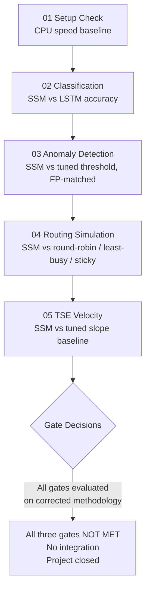
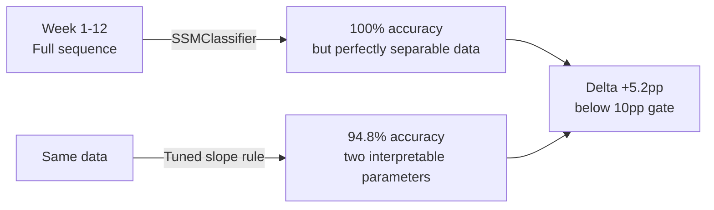
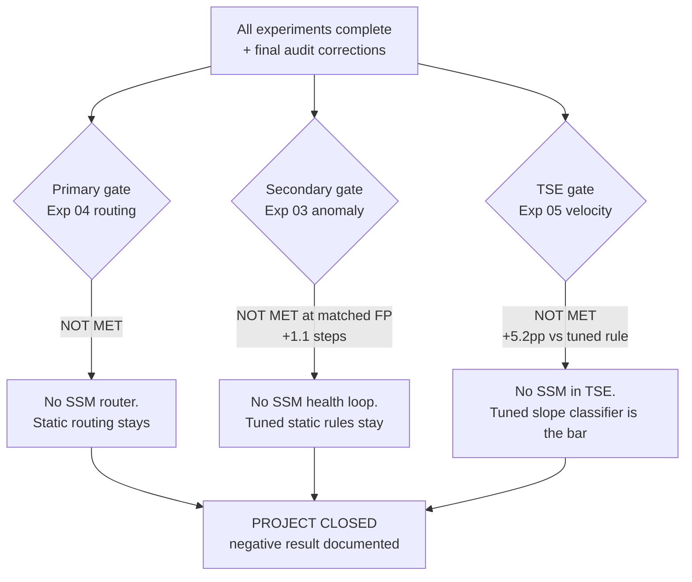

# Mamba Playground — Experiment Results Analysis

> Can Mamba-style State Space Models replace or improve on static heuristics in agent routing, anomaly detection, and trend tracking?

> **Final status (2026-08): CLOSED — negative result.** After the final external audit
> corrected baselines and comparison methodology, **none of the three gates passed**.
> See `external_final_audit.md` for the full audit trail.

---

## What Is It?

We ran five experiments to test whether a new type of neural model (SSM / Mamba) can outperform the simple rule-based logic currently used in our three production systems. The core bet was:

> **Transformers = reasoning** (keep for LLM prompts, planning, code generation)
> **Mamba/SSM = state tracking** (use for routing, monitoring, anomaly detection)

```
Traditional approach:       SSM approach:
┌──────────────────┐        ┌──────────────────────────────────┐
│ Rule: "round-    │        │ Learned: "given the last 32      │
│  robin across    │  vs.   │  events in this pool, the best   │
│  workers"        │        │  worker is #2 — it's been idle   │
└──────────────────┘        │  and has low error history"      │
                            └──────────────────────────────────┘
```

| Term | Plain English |
|------|--------------|
| SSM (State Space Model) | A model that processes sequences by maintaining a compressed memory of past events — like an LSTM but theoretically more efficient |
| Mamba | A specific SSM architecture with "selective" memory — it decides what to remember at each step |
| MinimalSSM | Our CPU-only pure-PyTorch implementation of Mamba — runs without a GPU |
| mamba-ssm | The official GPU-optimized package — 10–50x faster, requires CUDA |
| Baseline | The simple rule we're comparing against (round-robin, slope threshold, etc.) |

---

## The Five Experiments

```
mamba-playground/experiments/
├── 01_setup_check.py     ← Is the machine ready? What are the speed limits?
├── 02_event_classify.py  ← Can SSM recognize pool health states from event streams?
├── 03_anomaly_detect.py  ← Can SSM detect a failing worker earlier than a rule-based check?
├── 04_routing_sim.py     ← Does SSM routing beat round-robin / least-busy / sticky?
└── 05_tse_velocity.py    ← Does SSM classify trend velocity better than a tuned slope rule?
```

| Exp | Question | Type | Gate? |
|-----|----------|------|-------|
| 01 | Environment ready? | Setup | No |
| 02 | Classify normal/degrading/stuck | Sanity check | No |
| 03 | Detect anomaly onset earlier | **Secondary gate** | Yes |
| 04 | Route requests better | **Primary gate** | Yes |
| 05 | Classify trend velocity | **TSE gate** | Yes |

---

## Experiment Flow



---

## Results

### Exp 01 — CPU Speed Baseline

| Config | Throughput | Latency/batch | Verdict |
|--------|-----------|--------------|---------|
| seq=32, d_model=32, batch=32 | 1,008 seq/s | 31.7ms | Fast enough for routing |
| seq=64, d_model=32, batch=32 | 566 seq/s | 56.5ms | Fast enough for monitoring |
| seq=128, d_model=64, batch=16 | 154 seq/s | 103.9ms | Fast enough for TSE batch |

> On the RTX 5070 (Blackwell), expect 10–50x improvement — routing decisions in <1ms.

---

### Exp 02 — Event Stream Classification

Both models hit **100% accuracy immediately**. This tells us:

1. The synthetic data is perfectly separable — not a useful benchmark
2. SSM trains 20x **slower** than LSTM on CPU (252s vs 12s) due to sequential scan

```
SSMClassifier  ████████████████ 100%  252.6s  (sequential scan bottleneck)
LSTMClassifier ████████████████ 100%   12.2s  (PyTorch C++ LSTM kernel)

On GPU: SSM would be faster — parallel scan eliminates the bottleneck
```

> Exp 02 is a sanity check, not a gate. The ceiling result confirms the SSM implementation is correct — and that at these sequence lengths (≤64) an LSTM is at parity.

---

### Exp 03 — Anomaly Detection *(SECONDARY GATE)*

Final methodology (after Phase 2 + final audit): variable onset (20–65% of sequence),
threshold k tuned on val set, **detection lag compared at matched false-positive rates**,
onset-bucket breakdown, distribution shift test.

**Raw comparison (fixed score threshold 0.5) — misleading, shown for reference only:**

| Model | AUC | Mean lag | Miss rate | FP rate |
|-------|-----|---------|-----------|---------|
| SSMAnomalyDetector | **0.978** | **3.0 steps** | 0% | 37.3% |
| ThresholdDetector (tuned k=0.5) | 0.963 | 6.8 steps | 0% | **13.0%** |

The raw 3.8-step advantage is an artifact of comparing a trigger-happy detector against a
conservative one. **FP-matched comparison (the gate metric):**

| Model | Operating point | FP rate | Mean lag |
|-------|----------------|---------|----------|
| SSMAnomalyDetector | score thr = 0.80 | 11.0% | 5.75 steps |
| ThresholdDetector (tuned k=0.5) | k = 0.5 | 13.0% | 6.84 steps |

> **Secondary gate: NOT MET.** At matched FP rates the SSM detects only **1.1 steps**
> earlier; the gate requires ≥3.

**Distribution shift (onsets 68–80%, outside the training range) — including FP rates
that the pre-audit reports omitted:**

| Model | Shift AUC | Shift lag | Shift FP rate |
|-------|-----------|-----------|---------------|
| SSMAnomalyDetector | 0.996 | 0.00 steps | **100%** |
| ThresholdDetector | 0.928 | 3.95 steps | **52.5%** |

"Shift lag 0.00, generalises well" (pre-audit claim) was an artifact: the SSM fires before
onset in **every** shift sequence. The model learned that anomalies begin by 20–65% of the
sequence; when onset is later, it false-alarms while waiting. Neither detector is usable
off-distribution without threshold re-calibration.

**Onset-bucket breakdown (SSM, standard test):**

| Onset position | n | SSM lag | Interpretation |
|----------------|---|---------|----------------|
| Early (≤33%) | 99 | 6.94 steps | Anomaly starts before model has normal baseline |
| Mid (33–66%) | 201 | 1.05 steps | Best performance — enough normal context |

---

### Exp 04 — Routing Simulation *(PRIMARY GATE)*

Final methodology (after Phase 2 + final audit): `SSMQualityPredictor` (predict future
quality, not imitate oracle), queue-depth `least-busy`, `sticky` baseline, **cost term on
the per-call scale (0.015) so eval matches the training target**, **training on a separate
seed stream** (no episode overlap with evaluation), three pool conditions.

**In-distribution (default pool — 1 degrading worker at step 100):**

| Strategy | Quality | Latency | Error | Cost/req |
|----------|---------|---------|-------|---------|
| round-robin | 0.820 | 255ms | 5.4% | $0.0010 |
| least-busy | 0.860 | 222ms | 3.4% | $0.0000 |
| cost-aware | 0.860 | 222ms | 3.4% | $0.0000 |
| sticky | 0.829 | 244ms | 3.5% | $0.0013 |
| **SSMQualityPredictor** | **0.876** | **181ms** | 5.0% | $0.0000 |

> Note: with the corrected cost scale, strategies that touch the paid worker (round-robin,
> sticky) now pay for it in the composite; least-busy / cost-aware avoid it. In this pool
> cost-aware and least-busy are identical — the free workers are also the fast ones.

**Distribution shift (heavy degradation — 3/5 workers degrade from step 30–90):**

| Strategy | Quality | Drop vs in-dist | Seed-43 replication |
|----------|---------|-----------------|---------------------|
| **SSMQualityPredictor (seed 42)** | **0.877** | none (+0.1pp) | 0.705 — *worst* |
| sticky | 0.798 | −3.1pp | 0.797 |
| least-busy | 0.760 | −10.0pp | 0.761 |
| cost-aware | 0.748 | −11.2pp | 0.748 |
| round-robin | 0.717 | −10.3pp | 0.717 |

**Cost-regime shift (all-API pool — 5 paid workers, no degradation; added in final audit):**

| Strategy | Quality (seed 42) | Seed-43 replication |
|----------|-------------------|---------------------|
| least-busy | 0.738 | 0.737 |
| cost-aware | 0.738 | 0.737 |
| sticky | 0.721 | 0.722 |
| round-robin | 0.686 | 0.685 |
| SSMQualityPredictor | **0.741** | **0.558 — parks on the slowest, most expensive worker** |

> In an all-paid pool `cost-aware` degenerates **by construction** to least-busy (there is
> no free worker to prefer) — so cost-aware was never a distinct policy in any tested pool.
> Static strategies are stable by construction: their seed-43 numbers are identical to
> seed 42 (same policies, same physics). The learned router is not.

> **Primary gate: NOT MET.** SSM is **+5.6pp** over round-robin in-distribution (seed 43:
> +4.8pp — consistent); the gate requires >10pp.

**What the SSM actually learned, and why it can't be trusted off-distribution:** "park on
the best available worker." On seed 42 it locks onto `ollama-0` (181ms, 5% err, $0 — the
fastest free, non-degrading worker) and looks brilliant everywhere. On seed 43 the same
architecture, same data size, same hyperparameters locks onto the *worst* choices
off-distribution: a degrading worker on the heavy pool (19.3% errors), and `gpt-4`
(400ms, $0.015) on the all-API pool. The in-distribution gain is real but small; the
out-of-distribution behaviour swings from **best strategy to worst strategy on the
training seed**. A production router must be predictable — this one is a coin flip
outside its training pool.

**Where this leaves the v2 claims:** v2's "SSM drops −14.4% on shift, sticky most robust"
was computed with seed leakage (training episodes = eval episodes), so its specific
numbers were invalid — but the replication shows the *qualitative* concern was right:
the learned router does not reliably generalize. The corrected picture is worse than
"fragile": it is unpredictably fragile.

---

### Exp 05 — TSE Trend Velocity Tracking *(TSE GATE)*

12 weeks × 3 features per trend. 4 classes: rising / peaking / declining / noise.

**Final methodology (after final audit): the baseline's slope threshold is tuned on the
same validation split the SSM uses** — mirroring the k-sweep that Phase 2 added to Exp 03.

| Model | Accuracy | Rising | Peaking | Declining | Noise |
|-------|----------|--------|---------|-----------|-------|
| SSMClassifier | **1.000** | **1.000** | **1.000** | **1.000** | **1.000** |
| Slope baseline, **val-tuned** (thr=0.06) | **0.948** | 0.990 | 0.991 | 1.000 | 0.789 |
| Slope baseline, fixed thr=0.08 (v1, reference) | 0.507 | 0.105 | 0.982 | 0.033 | 0.856 |

> **TSE gate: NOT MET.** SSM is +5.2pp over the tuned baseline — the gate requires >10pp.

**What the pre-audit version got wrong:** the fixed threshold 0.08 sits ~1.5σ *above* the
generator's true rising/declining slope (0.8/11 ≈ 0.0736 ± 0.0043 per week), so the
baseline classified nearly every monotonic trend as noise (rising 10.5%, declining 3.3%).
That alone produced the pre-audit "+49.3%" headline. The earlier doc also explained the
failure as "short 3-week window can't see a saturating rise" — but the baseline's first
decision branch is a regression over all 12 weeks, and the generator's rising trend is
linear, not saturating. The failure was the threshold, not the window.

**Where the SSM still genuinely wins:** the noise class (+21pp). The tuned threshold
over-fires rising/declining on noisy sequences (a noisy series sometimes fits a steep
line); the SSM separates "random" from "shaped" better. On synthetic data *designed* to
favor shape recognition, that is worth 5 points total — not 49, and not enough for the gate.



---

## Integration Decision



| Project | Component | Final finding | Decision |
|---------|-----------|---------------|----------|
| agent-pool routing | SSMQualityPredictor | +5.6pp over round-robin in-dist (gate >10pp); shift behaviour swings from best to worst across training seeds | **No integration** — small in-dist upside, unpredictable off-distribution |
| agent-pool routing | sticky | Robust on degradation shift (2nd), weaker in-dist and in cost-sensitive pools | Candidate for A/B on the real pool; not a synthetic-data verdict |
| agent-pool health loop | SSMAnomalyDetector | +1.1 steps at matched FP (gate ≥3); FP=100% on shift | **No integration** — tuned static rules stay |
| SimpleAO Guard | SSMAnomalyDetector | Same model, same shortfall | **No integration** |
| TSE velocity | SSMVelocityTracker | +5.2pp over tuned slope rule (gate >10pp) | **No integration** — tuned slope classifier is the tool |

---

## Lessons Learned

| Lesson | What Happened | What It Means |
|--------|--------------|---------------|
| Imitation learning sets the ceiling | v1 SSMRouter copied cost-aware exactly — couldn't beat it | Training target defines maximum performance; use quality prediction instead |
| Broken baselines hide real results | v1 least-busy = round-robin (0.602 each); fixed version = 0.860 | Always verify that baselines test distinct policies before drawing conclusions |
| **Tune every baseline, every time** | v1/v2 Exp 05 used a fixed slope threshold ~1.5σ above the true signal — "+49.3%" collapsed to +5.2pp after tuning | The same lesson Phase 2 applied to Exp 03 was forgotten in Exp 05; a gate is only as honest as its weakest-tuned baseline |
| **Compare detectors at matched operating points** | Exp 03 "passed" with a 3.8-step advantage at FP 39% vs 18%; at matched FP the advantage is 1.1 steps | Lag/AUC comparisons without matching FP rates reward trigger-happy models |
| **Single runs mislead; replicate across seeds** | v2 (leaky seeds) called the router shift-fragile; the corrected seed-42 run called it the most robust (0.877); the seed-43 replication put it last again (0.705 / 0.558) | Neither a leaky number nor one clean run supports a robustness claim — the learned router's shift behaviour is a training-seed coin flip |
| A learned policy may just re-derive a simple one | Seed-42 router = "park on the best worker" (sticky with foresight); seed-43 router parked on the worst choices off-distribution | Even the policy's identity is seed-dependent; if the best case is isomorphic to a heuristic, ship the heuristic |
| Tuned baseline changes the story | v1 threshold missed 100%; tuned threshold detects with ~7 step lag | A single untuned configuration is not a fair baseline — always tune on val set |
| High FP rate is a practical concern | SSM 37–39% FP vs threshold 13–18%; FP=100% on shift set | Raw score thresholds don't transfer across distributions |
| Optimise and judge on the same objective | v2 routing eval had an inert cost term (scale 1.0 vs 0.015 in training target) | Metric normalisation constants are part of the experiment design |
| SSM's advantage needs length | At seq 12–64, LSTM/slope rules match the SSM; SSM trained 20x slower on CPU | Mamba's case (linear-time long sequences) never engaged in this playground |
| Cost-aware fails under adversarial conditions | Cost-aware routes to free workers — exactly the ones degrading; in all-paid pools it degenerates to least-busy by construction | Business-objective heuristics can have correlated failure modes and hidden no-op conditions |

---

## Quick Commands

```bash
# Run all experiments in order
python experiments/01_setup_check.py
python experiments/02_event_classify.py
python experiments/03_anomaly_detect.py
python experiments/04_routing_sim.py
python experiments/05_tse_velocity.py

# Run only the gates (skip sanity checks)
python experiments/03_anomaly_detect.py
python experiments/04_routing_sim.py
python experiments/05_tse_velocity.py

# Smoke tests (shapes, forward passes, report safety)
python tests/test_smoke.py

# Read results
cat results/03_anomaly_report.json
cat results/04_routing_report.json
cat results/05_tse_velocity_report.json
```

---

## Current Status

```
Exp 01  ✅ complete — CPU ready, 1008 seq/s at seq=32
Exp 02  ✅ complete — SSM correct; synthetic data too easy to rank models
Exp 03  ✅ complete (final audit) — SECONDARY GATE NOT MET:
                                 +1.1 steps at matched FP rate (gate ≥3)
Exp 04  ✅ complete (final audit + seed replication) — PRIMARY GATE NOT MET:
                                 +5.6pp / +4.8pp over round-robin (gate >10pp)
                                 shift behaviour is training-seed dependent:
                                 0.877→0.705 (degradation), 0.741→0.558 (all-API)
Exp 05  ✅ complete (final audit) — TSE GATE NOT MET:
                                 +5.2pp over val-tuned slope baseline (gate >10pp)

PROJECT CLOSED (2026-08) — negative result on all three gates.
No SSM integration into agent-pool, SimpleAO, or TSE.
Reopen conditions: real event traces / real TSE history + streaming cadence
(see external_final_audit.md §6).
```
