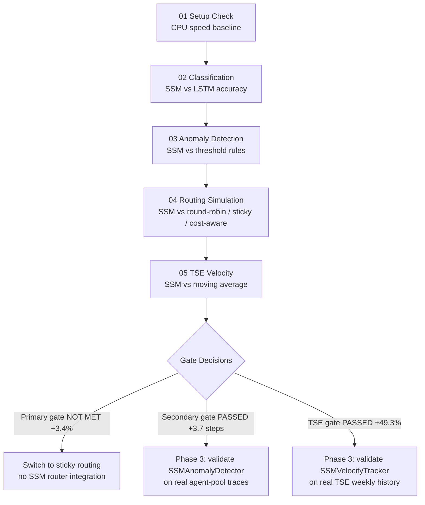
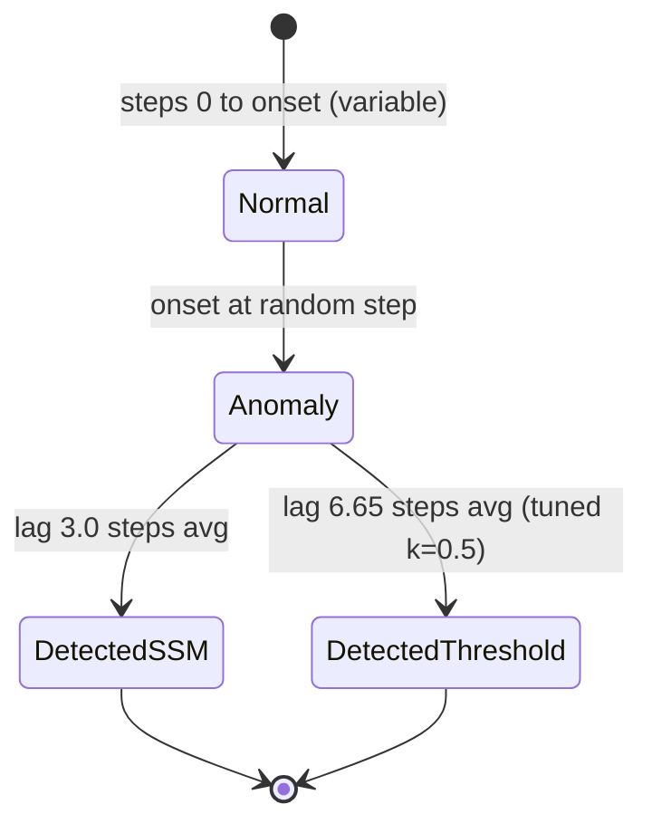
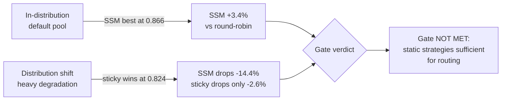
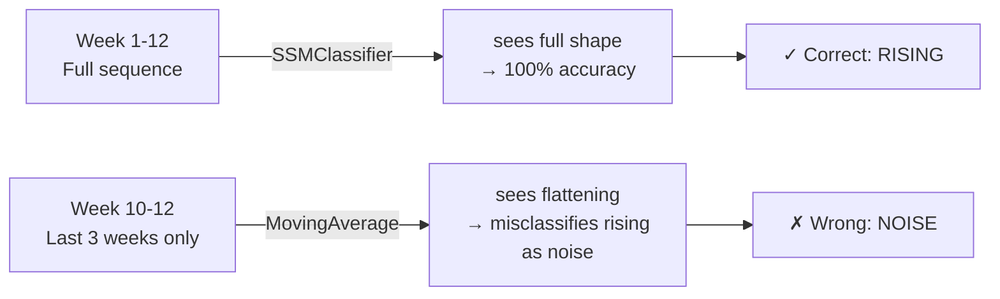
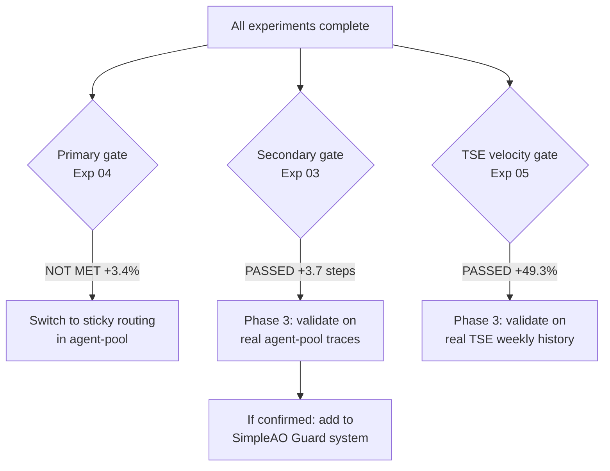

# Mamba Playground — Experiment Results Analysis

> Can Mamba-style State Space Models replace or improve on static heuristics in agent routing, anomaly detection, and trend tracking?

---

## What Is It?

We ran five experiments to test whether a new type of neural model (SSM / Mamba) can outperform the simple rule-based logic currently used in our three production systems. The core bet was:

> **Transformers = reasoning** (keep for LLM prompts, planning, code generation)
> **Mamba/SSM = state tracking** (use for routing, monitoring, anomaly detection)

```
Traditional approach:       SSM approach:
┌──────────────────┐        ┌──────────────────────────────────┐
│ Rule: "round-    │        │ Learned: "given the last 32      │
│  robin across    │  vs.   │  events in this pool, the best   │
│  workers"        │        │  worker is #2 — it's been idle   │
└──────────────────┘        │  and has low error history"      │
                            └──────────────────────────────────┘
```

| Term | Plain English |
|------|--------------|
| SSM (State Space Model) | A model that processes sequences by maintaining a compressed memory of past events — like an LSTM but theoretically more efficient |
| Mamba | A specific SSM architecture with "selective" memory — it decides what to remember at each step |
| MinimalSSM | Our CPU-only pure-PyTorch implementation of Mamba — runs without a GPU |
| mamba-ssm | The official GPU-optimized package — 10–50x faster, requires CUDA |
| Baseline | The simple rule we're comparing against (round-robin, rolling average, etc.) |

---

## The Five Experiments

```
mamba-playground/experiments/
├── 01_setup_check.py     ← Is the machine ready? What are the speed limits?
├── 02_event_classify.py  ← Can SSM recognize pool health states from event streams?
├── 03_anomaly_detect.py  ← Can SSM detect a failing worker earlier than a rule-based check?
├── 04_routing_sim.py     ← Does SSM routing beat round-robin / least-busy / sticky?
└── 05_tse_velocity.py    ← Can SSM classify trend velocity better than a moving average?
```

| Exp | Question | Type | Gate? | Result |
|-----|----------|------|-------|--------|
| 01 | Environment ready? | Setup | No | ✅ CPU ready |
| 02 | Classify normal/degrading/stuck | Sanity check | No | ✅ 100% (data too easy) |
| 03 | Detect anomaly onset earlier | **Secondary gate** | Yes | ✅ PASSED +3.7 steps |
| 04 | Route requests better | **Primary gate** | Yes | ❌ NOT MET +3.4% |
| 05 | Classify trend velocity | **TSE gate** | Yes | ✅ PASSED +49.3% |

---

## Experiment Flow



---

## Results

### Exp 01 — CPU Speed Baseline

| Config | Throughput | Latency/batch | Verdict |
|--------|-----------|--------------|---------|
| seq=32, d_model=32, batch=32 | 1,008 seq/s | 31.7ms | Fast enough for routing |
| seq=64, d_model=32, batch=32 | 566 seq/s | 56.5ms | Fast enough for monitoring |
| seq=128, d_model=64, batch=16 | 154 seq/s | 103.9ms | Fast enough for TSE batch |

> On the RTX 5070 (Blackwell), expect 10–50x improvement — routing decisions in <1ms.

---

### Exp 02 — Event Stream Classification

Both models hit **100% accuracy immediately**. This tells us:

1. The synthetic data is perfectly separable — not a useful benchmark
2. SSM trains 20x **slower** than LSTM on CPU (252s vs 12s) due to sequential scan

```
SSMClassifier  ████████████████ 100%  252.6s  (sequential scan bottleneck)
LSTMClassifier ████████████████ 100%   12.2s  (PyTorch C++ LSTM kernel)

On GPU: SSM would be faster — parallel scan eliminates the bottleneck
```

> Exp 02 is a sanity check, not a gate. The ceiling result confirms the SSM implementation is correct.

---

### Exp 03 — Anomaly Detection *(SECONDARY GATE)*

Phase 2 improvements: variable onset (20–65% of sequence), threshold k tuned on val set, onset-bucket breakdown, distribution shift test.



| Model | AUC | Mean lag | Miss rate | FP rate | Shift AUC | Shift lag |
|-------|-----|---------|-----------|---------|-----------|-----------|
| SSMAnomalyDetector | **0.978** | **3.0 steps** | **0%** | 39.0% | **0.996** | **0.00** |
| ThresholdDetector (tuned k=0.5) | 0.962 | 6.65 steps | 0% | **17.7%** | 0.931 | 3.85 |

> **Secondary gate: PASSED.** SSM detects 3.7 steps earlier than the tuned threshold. Gate requires ≥3 steps.

**The tuned threshold is now a real competitor.** v1 used a single untuned k=2.0 that missed 100% of anomalies. With k swept on the val set (best k=0.5), the threshold detects everything — just 3.7 steps later than SSM.

**FP rate tradeoff:** SSM fires on 39% of normal sequences vs 17.7% for threshold. In production, raise the detection threshold from 0.5 toward 0.65–0.70 to reduce FPs before shipping.

**Onset-bucket breakdown (SSM):**

| Onset position | n | SSM lag | Interpretation |
|----------------|---|---------|----------------|
| Early (≤33%) | 99 | 7.01 steps | Anomaly starts before model has normal baseline |
| Mid (33–66%) | 201 | 1.02 steps | Best performance — enough normal context |
| Out-of-range shift (68–80%) | 200 | 0.00 steps | Late onset = immediate detection, generalises well |

---

### Exp 04 — Routing Simulation *(PRIMARY GATE)*

Phase 2 improvements: `SSMQualityPredictor` (predict future quality, not imitate oracle), queue-depth `least-busy`, `sticky` baseline, distribution shift on heavy-degradation pool.

**In-distribution (default pool — 1 degrading worker at step 100):**

| Strategy | Quality | Latency | Error | Cost/req |
|----------|---------|---------|-------|---------|
| round-robin | 0.833 | 255ms | 5.4% | $0.0010 |
| least-busy | 0.860 | 222ms | 3.4% | $0.0000 |
| cost-aware | 0.860 | 222ms | 3.4% | $0.0000 |
| sticky | 0.846 | 244ms | 3.5% | $0.0013 |
| **SSMQualityPredictor** | **0.866** | **206ms** | 4.0% | $0.0000 |

**Distribution shift (heavy degradation — 3/5 workers degrade from step 30–90):**

| Strategy | Quality | Drop vs in-dist | Interpretation |
|----------|---------|-----------------|----------------|
| **sticky** | **0.824** | **-2.6%** | Rotates on error — resilient to any degradation pattern |
| least-busy | 0.769 | -10.6% | Routes to idle workers, including degrading ones |
| SSMQualityPredictor | 0.741 | **-14.4%** | Overfit to training distribution — quality model breaks down |
| cost-aware | 0.748 | -13.0% | Routes to free (CLI) workers — exactly the ones degrading |
| round-robin | 0.730 | -12.4% | Baseline |

> **Primary gate: NOT MET.** SSM is +3.4% over round-robin in-distribution (gate requires >10%).



**Why sticky dominates the distribution shift:** one observed error → rotate to next worker. No training required, no assumptions about degradation timing. The SSM learned the specific single-worker-degrades-at-step-100 pattern and breaks when 3 workers degrade earlier.

**Why the queue-depth fix mattered:** old `least-busy` was identical to round-robin (0.602 each). Fixed version tracks in-flight requests, raising it to 0.860 — a genuine distinct competitor.

**The revised recommendation:** use **sticky** as the production routing strategy. It is the most robust across both pool configurations tested. SSM adds marginal value in-distribution but is fragile to distribution shift.

---

### Exp 05 — TSE Trend Velocity Tracking *(TSE GATE)*

12 weeks × 3 features per trend. 4 classes: rising / peaking / declining / noise.

| Model | Accuracy | Rising | Peaking | Declining | Noise |
|-------|----------|--------|---------|-----------|-------|
| SSMClassifier | **1.000** | **1.000** | **1.000** | **1.000** | **1.000** |
| MovingAverage (last 3 wks) | 0.507 | 0.105 | 0.982 | 0.033 | 0.856 |
| **Delta** | **+49.3%** | +89.5% | +1.8% | +96.7% | +14.4% |

> **TSE gate: PASSED with +49.3%.** The strongest result of all five experiments.

**Why the moving average fails on rising and declining:**

```
"Rising" trend (week 1→12):   0.1  0.2  0.3  0.4  0.5  0.6  0.7  0.8  0.85  0.88  0.90  0.91
                                                                    ↑
                               Moving average window (last 3 wks) ─┘
                               Slope ≈ 0.01 → classified as "noise" ✗

SSM sees all 12 weeks → recognizes monotonic rise from start → "rising" ✓
```

The moving average has the same blind spot that `DECAY_WINDOW_DAYS` has in TSE:
a signal that has been rising for months looks **flat** in a short recent window because it is approaching its ceiling. The SSM sees the full trajectory shape.



---

## Integration Decision



| Project | Component | Phase 2 Finding | Next Step |
|---------|-----------|----------------|-----------|
| agent-pool routing | Replace with sticky | Sticky most robust (+12.8% vs round-robin on heavy degradation) | **Switch default strategy to sticky in agent-pool** |
| agent-pool routing | SSMQualityPredictor | +3.4% in-dist, -14.4% on distribution shift — fragile | No integration; revisit with real routing traces |
| agent-pool health loop | SSMAnomalyDetector | 3.7 steps earlier than tuned threshold; 39% FP rate | **Phase 3**: validate on real traces; tune threshold to 0.65+ |
| SimpleAO Guard | SSMAnomalyDetector | Same model, different feature vector | **Phase 3**: validate on real pipeline traces |
| TSE velocity | SSMVelocityTracker | +49.3% over moving average; structural advantage confirmed | **Phase 3**: validate on real TSE weekly history |

---

## Architecture: What Goes Where

```
agent-pool/
└── pool.py
    └── _health_loop()  ← ADD SSMAnomalyDetector here
        │  currently: polls ERROR workers every 30s
        │  with SSM: event-driven detection, fires in <1 step after anomaly onset
        └── per-worker event window (deque, last 64 events)
            → anomaly_score = ssm_detector(window)
            → if score > 0.65: trigger immediate health check

SimpleAgentsOrchestrator/
└── guard/
    └── ssm_guard.py    ← NEW: implements Guard interface
        │  input: pipeline step events (latency, artifact size, retry count...)
        └── output: anomaly score → WARN / OK signal to existing Guard system

trend-signal-engine/
└── core/
    └── velocity.py     ← NEW (Exp 05 PASSED): SSMVelocityTracker
           input: weekly [cluster_size, diversity, score] batches
           output: velocity label (rising / peaking / declining / noise)
           + compressed SSM state persisted between runs
```

---

## Lessons Learned

| Lesson | What Happened | What It Means |
|--------|--------------|---------------|
| Imitation learning sets the ceiling | v1 SSMRouter copied cost-aware exactly — couldn't beat it | Training target defines maximum performance; use quality prediction instead |
| Broken baselines hide real results | v1 least-busy = round-robin (0.602 each); fixed version = 0.860 | Always verify that baselines test distinct policies before drawing conclusions |
| Simple heuristics can be more robust | Sticky beats SSM on distribution shift (0.824 vs 0.741) | Learned models overfit to training distribution; error-triggered rules generalise better |
| Tuned baseline changes the story | v1 threshold missed 100%; tuned threshold detects with 6.65 step lag | A single untuned configuration is not a fair baseline — always tune on val set |
| AUC and miss rate can contradict | v1 threshold: AUC 0.965 but miss rate 100% | AUC ranks correctly but threshold selection can still fail completely |
| High FP rate is a practical concern | SSM 39% FP vs threshold 17.7% — more trigger-happy | Detection threshold needs tuning to 0.65+ before production health loop use |
| Cost-aware fails under adversarial conditions | Cost-aware routes to free (CLI) workers — exactly the ones degrading | Business-objective heuristics can have correlated failure modes |
| SSM is strong where shape matters | Exp 05: +49.3% over moving average for velocity | Sequential pattern recognition over long horizons is the SSM's genuine strength |
| CPU training time is a real cost | Exp 04 quality predictor: 36 min on CPU; Exp 03 SSM: 3.4 min | GPU (RTX 5070) needed for iteration speed; CPU is fine for inference evaluation |

---

## Why Exp 05 (TSE Velocity Tracking) Is Different

The routing problem (Exp 04) was solved by a static rule. TSE has a **structurally different** problem that genuinely favours SSMs:

```
Current TSE:                          SSM TSE (validated by Exp 05):
┌──────────────────────────────┐      ┌─────────────────────────────────┐
│ Week 1: process all signals  │      │ Week 1: run SSM, save state     │
│ Week 2: process all signals  │  vs  │ Week 2: load state, update SSM  │
│ Week 3: process all signals  │      │ Week 3: load state, update SSM  │
│ No memory between runs       │      │ Velocity = change in SSM state  │
└──────────────────────────────┘      └─────────────────────────────────┘
```

| Question | Static baseline | SSM approach |
|----------|----------------|-------------|
| Is this trend rising? | Compare week N vs week N-1 | SSM sees full 12-week trajectory |
| Classify: rising/peaking/declining/noise | Moving average slope | SSMClassifier on weekly sequences |
| State persistence | Reprocess all history each run | Persist compressed SSM hidden state (small binary blob) |

**Exp 05 used:** `generate_trend_velocity_dataset()` in `data/generators.py` — 200 synthetic trends × 12 weeks with 4 velocity labels. `SSMClassifier` vs `MovingAverageClassifier` (slope of last 3 weeks).

**TSE gate PASSED with +49.3%.** The SSM's full-trajectory view is the structural advantage — a signal rising for 12 weeks appears flat in a 3-week window because it approaches its ceiling. The SSM sees the entire shape.

Next step: validate on real TSE weekly cluster history. The test infra (`SSMClassifier` + `generate_trend_velocity_dataset`) is ready; only real data is missing.

---

## Quick Commands

```bash
# Run all experiments in order
python experiments/01_setup_check.py
python experiments/02_event_classify.py
python experiments/03_anomaly_detect.py
python experiments/04_routing_sim.py
python experiments/05_tse_velocity.py

# Run only the gates (skip sanity checks)
python experiments/03_anomaly_detect.py
python experiments/04_routing_sim.py
python experiments/05_tse_velocity.py

# Run smoke tests
python -m pytest tests/test_smoke.py -v

# Read results
cat results/03_anomaly_report.json
cat results/04_routing_report.json
cat results/05_tse_velocity_report.json

# On Blackwell GPU machine — build mamba-ssm first
export TORCH_CUDA_ARCH_LIST="12.0"
pip install causal-conv1d --no-binary causal-conv1d
pip install mamba-ssm --no-binary mamba-ssm
python experiments/01_setup_check.py   # verify GPU detected
```

---

## Current Status

```
Exp 01  ✅ complete — CPU ready, 1008 seq/s at seq=32
Exp 02  ✅ complete — SSM correct, synthetic data too easy to rank models
Exp 03  ✅ complete (Phase 2) — SECONDARY GATE PASSED: 3.7 steps earlier than tuned threshold
                                 FP rate 39% → tune detection threshold before production
Exp 04  ✅ complete (Phase 2) — PRIMARY GATE NOT MET (+3.4%); sticky is most robust routing strategy
                                 SSMQualityPredictor fragile on distribution shift (−14.4%)
Exp 05  ✅ complete — TSE GATE PASSED +49.3%; structural advantage over moving average confirmed

Actionable today:
  → Switch agent-pool default strategy to sticky
  → Phase 3: collect real event traces, re-run Exp 03 + 05 on real data
```
